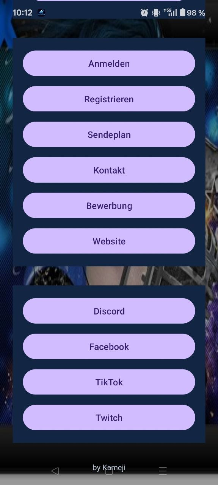
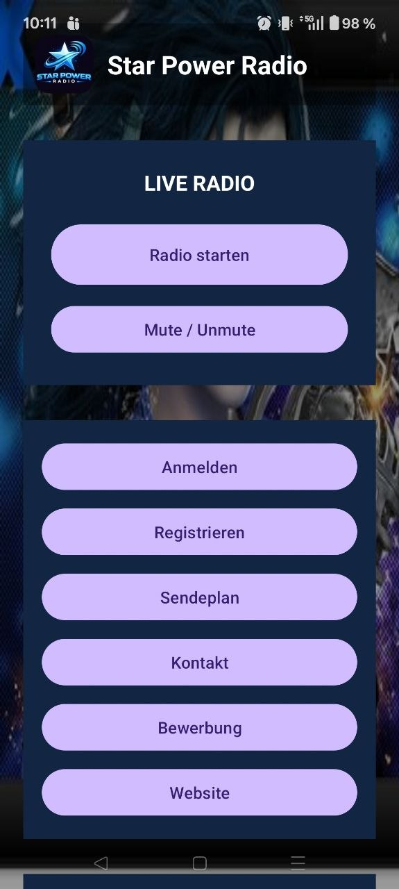
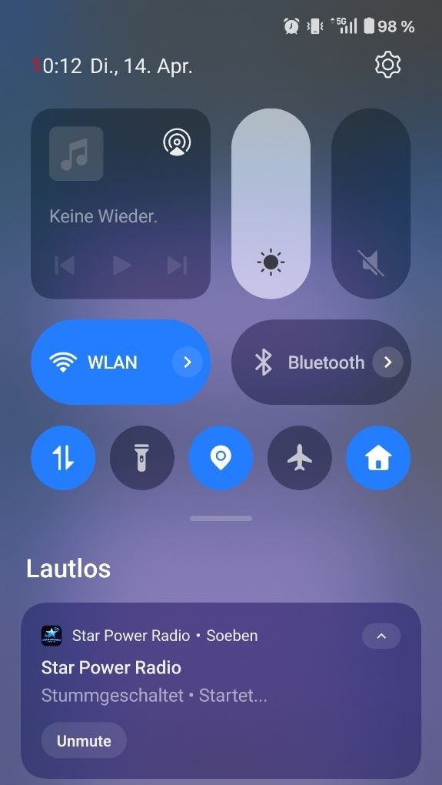
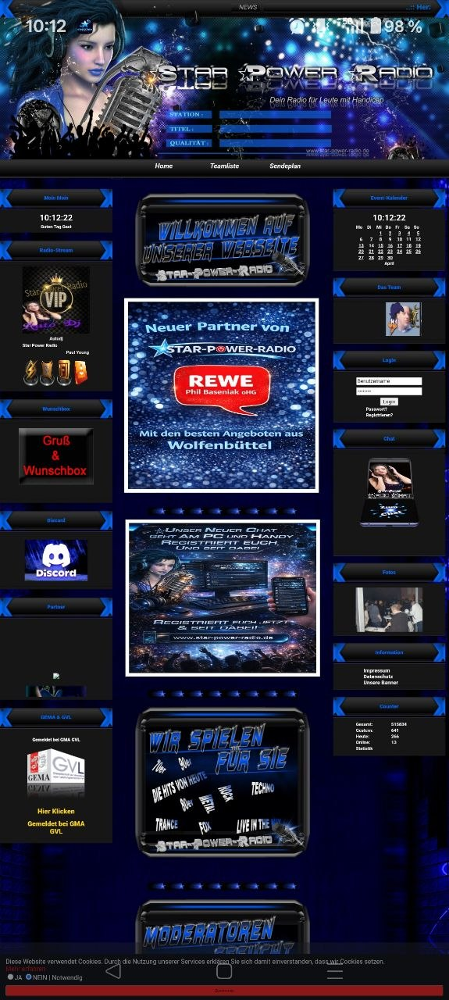

# 🎧 Star Power Radio – Android App

Android application for **Star Power Radio** with live audio streaming, background playback and integrated WebView navigation.

---

## 🚀 Features

* ▶️ Live radio streaming (MP3 stream)
* 🔊 Background playback (audio continues when app is minimized)
* 🔕 Mute / Unmute directly from notification
* 🌐 Integrated WebView (website, login, sendeplan, contact)
* 🔗 Quick access to social platforms (Discord, Facebook, TikTok, Twitch)
* 📱 Clean and simple UI

---

## 🛠 Tech Stack

* Kotlin
* Android SDK
* ExoPlayer (audio streaming)
* Foreground Service (background playback)
* WebView integration

---

## 📦 Installation

### Option 1 – APK (recommended)

Download the latest APK and install it on your Android device.

https://github.com/Kameji98/star-power-radio-android-app/releases/download/v1.0/Star.Power.Radio.apk

---

### Option 2 – Build from source

1. Clone the repository:

```bash
git clone https://github.com/Kameji98/star-power-radio-android-app.git
```

2. Open in Android Studio

3. Build & run on device or emulator

---

## ⚠️ Important Notes

* Sensitive data such as IPs or API endpoints are **not included** in this public version.
* Replace the placeholder values with your own configuration if needed.

---

## 📸 Screenshots

<p align="center">
  
  
  
  
</p>

---

## 📡 About the Radio

Star Power Radio is an online radio station offering live music and entertainment.

---

## 👨‍💻 Author

**Kameji98**
GitHub: https://github.com/Kameji98

---

## ⭐ Support

If you like this project, feel free to ⭐ the repository.
